# JMViews — Digital Services Studio

JMViews is a one-person digital services studio that brings together **web design & development**, **photography + aerial cinematography**, **video editing/motion**, and **branding** in one place.

The site is designed for clients who want a clean and modern way to **submit a project enquiry**, **track progress**, **download delivered files**, and **pay securely** (deposit + final balance) via Stripe. It also acts as a professional presence for the JMViews brand, showcasing services and providing clear ways to get in touch.

**Live site:**  https://jmviews-p4-1b43f32fc4e1.herokuapp.com/
**Repository:** https://github.com/JermaineMckenna/jmviewsp4

---

## Table of Contents

- [User Experience](#user-experience)
  - [Project Goals](#project-goals)
  - [Target Audience](#target-audience)
  - [User Stories](#user-stories)
- [Design](#design)
  - [Colour Scheme & Typography](#colour-scheme--typography)
  - [Wireframes](#wireframes)
- [Features](#features)
  - [Existing Features](#existing-features)
  - [Future Features](#future-features)
- [Database & Data Model](#database--data-model)
- [E-commerce / Payments (Stripe)](#e-commerce--payments-stripe)
- [Testing](#testing)
  - [Manual Testing](#manual-testing)
  - [Validator Testing](#validator-testing)
  - [Known Bugs](#known-bugs)
- [Deployment](#deployment)
  - [Heroku](#heroku)
  - [Local Development](#local-development)
- [Technologies Used](#technologies-used)
- [Credits](#credits)

---

## User Experience

### Project Goals
- Provide a clean public-facing studio site (Home, Services, Portfolio, About, Contact).
- Allow clients to create an account and submit a **new enquiry**.
- Allow clients to view **orders**, read updates, download files, and make **secure payments**.
- Provide a simple admin workflow for managing services, orders, and deliverables.

### Target Audience
- Individuals and small businesses who need:
  - A modern website
  - Photography and drone visuals
  - Short-form video edits
  - Branding/logo assets

### User Stories

**First-time visitor**
- As a visitor, I can view services so I understand what JMViews offers.
- As a visitor, I can navigate easily across pages on desktop and mobile.
- As a visitor, I can contact JMViews directly via email or socials.

**Client**
- As a client, I can register/login to submit an enquiry.
- As a client, I can view my order details and project brief.
- As a client, I can pay a deposit / final balance securely.
- As a client, I can download delivered files once uploaded.

**Admin/Staff**
- As staff, I can manage services displayed on the website.
- As staff, I can view all client orders and update them.
- As staff, I can upload deliverables/files to an order.

---

## Design

### Colour Scheme & Typography
- Dark, modern UI inspired by “studio” style dashboards.
- Accent colour used for calls-to-action and emphasis.
- Clean system font stack for performance and consistency.

### Wireframes
Wireframes are stored in: `documentation/wireframes/`

- Home (Desktop)  
  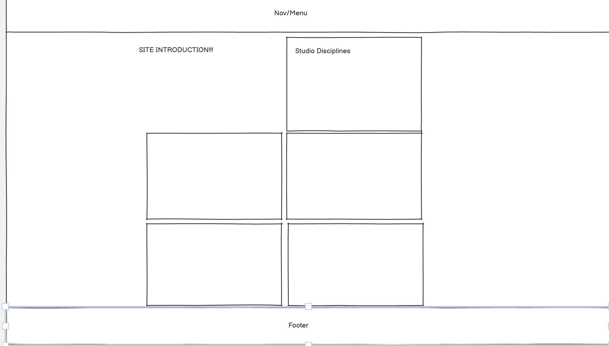

- Services (Desktop)  
  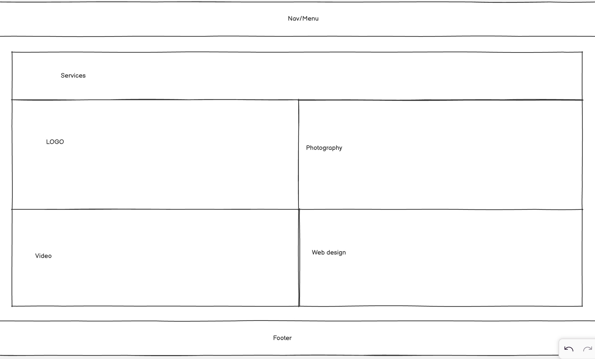

- Contact (Desktop)  
  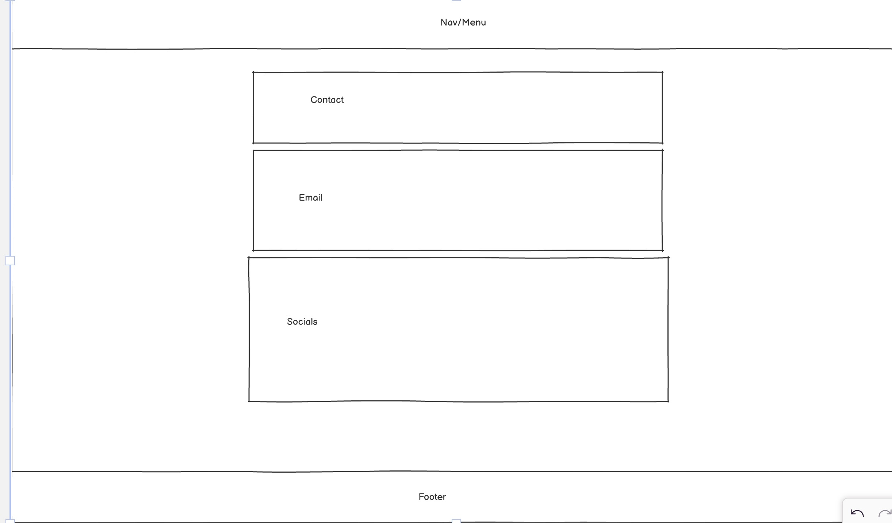

- Register (Desktop)
  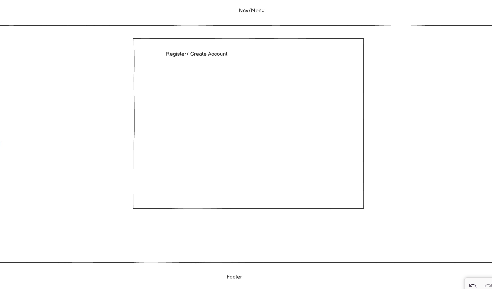

- Login (Desktop)
  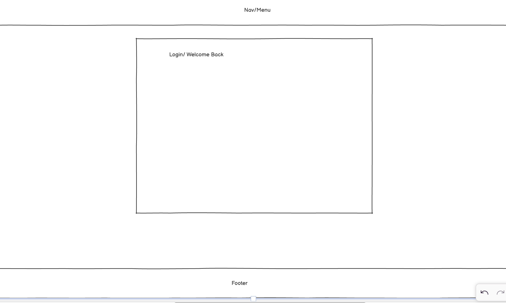

---

## Features

### Existing Features

#### Navigation Bar
- Responsive nav with links to Home, Services, Portfolio, About and Contact.
- Login/Register shown for logged-out users.
- Orders/Logout shown for logged-in users.


---

#### Home Page
- Studio introduction with CTA buttons.
- Clear paths to Services, Portfolio, and Contact.

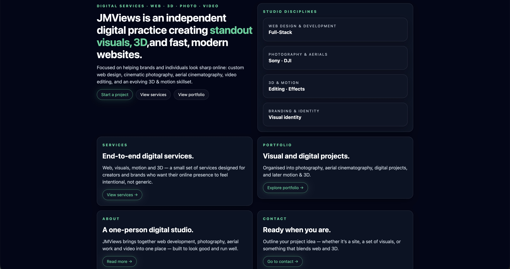
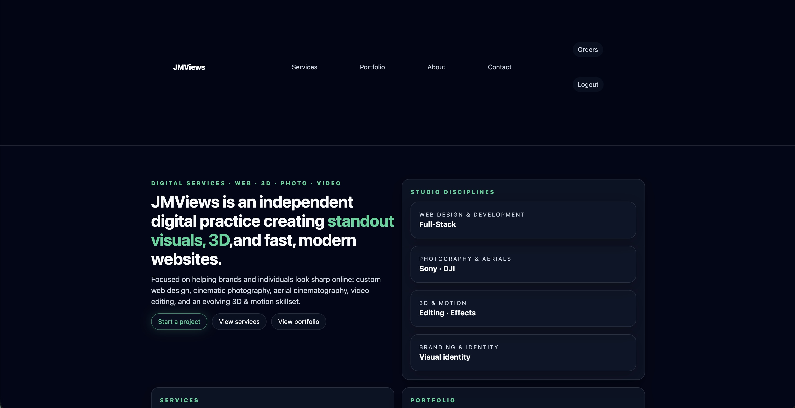
---

#### Services Page
- Four core service cards with “from” pricing.
- Enquiry CTA routes users into the order/enquiry flow.

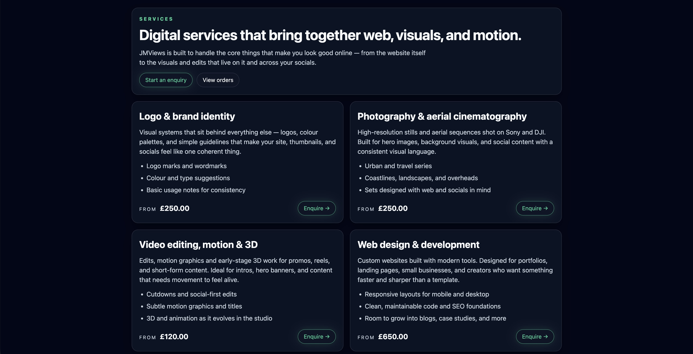

---

#### Contact Page
- Direct email CTA (mailto link).
- Social links for studio platforms.

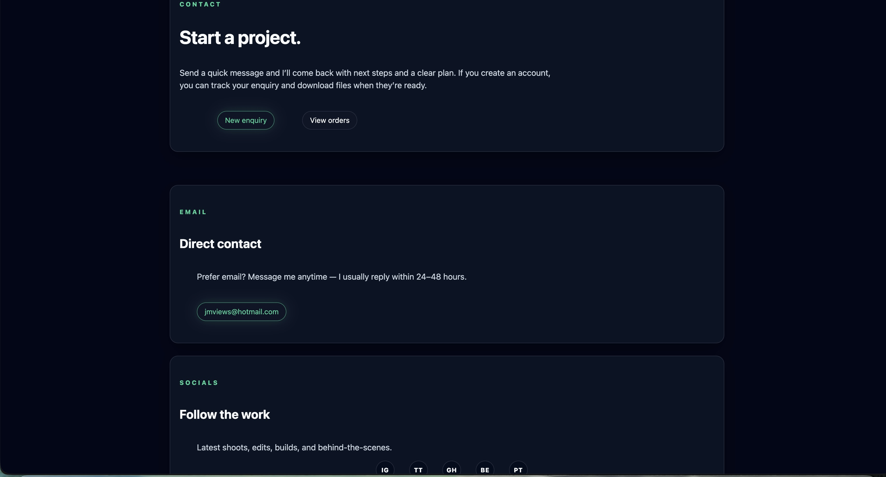
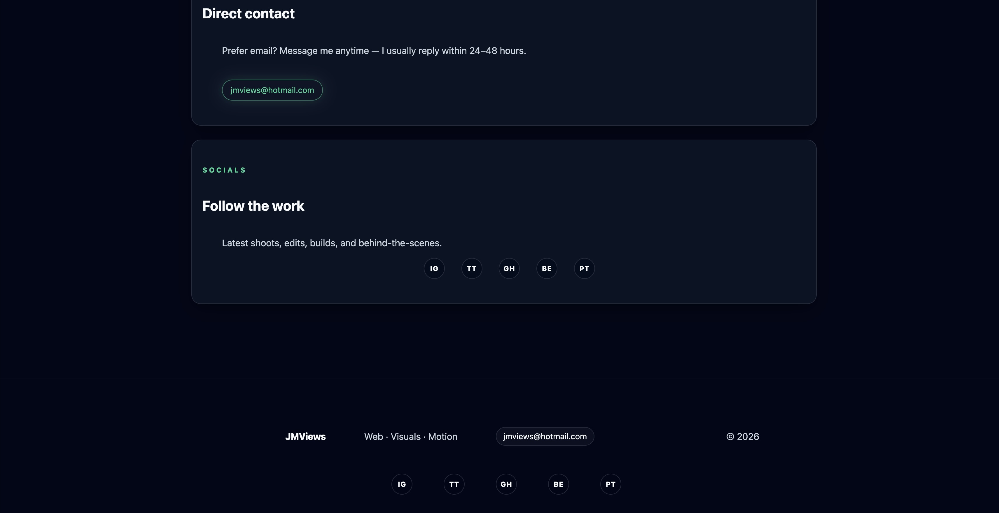

---

#### Account Registration & Login
- Users can create accounts and log in to access orders and payments.

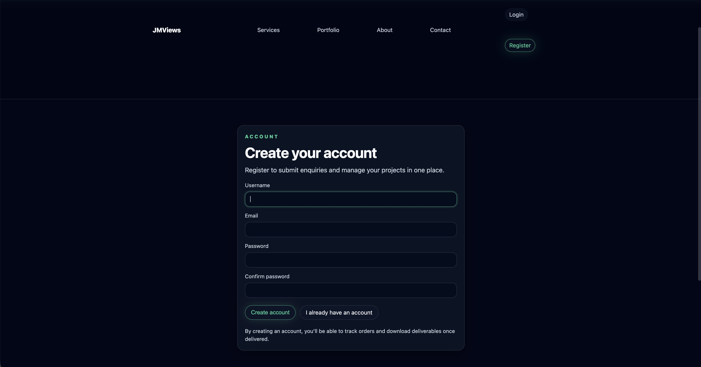  
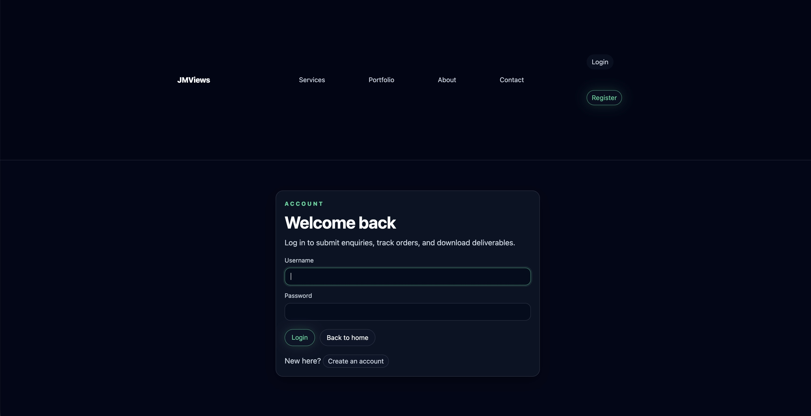

---

#### Orders (Client Dashboard)
- Clients can view a list of their orders.
- Each order includes status, service, and key project details.

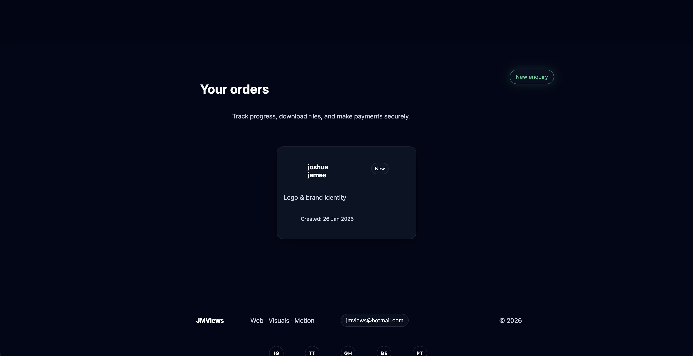

---

#### Order Detail (Brief, Files, Payments)
- Project brief displayed clearly.
- File downloads appear when deliverables are uploaded.
- Stripe payments supported for deposit and final balance.

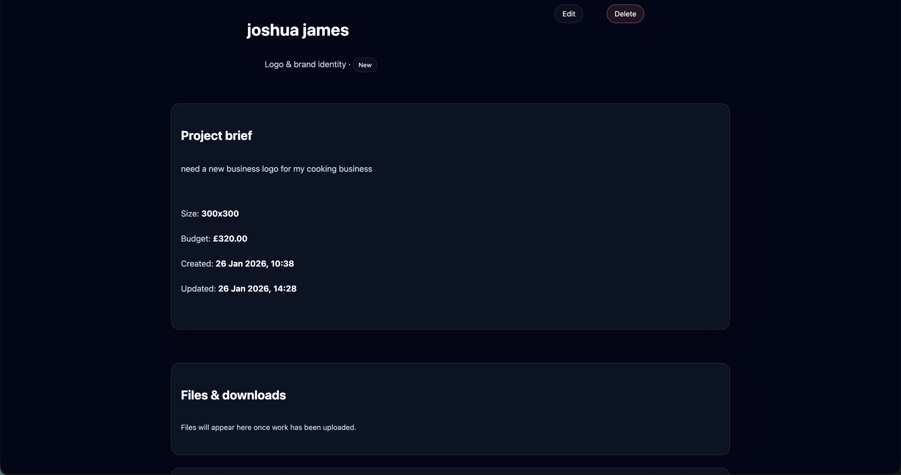
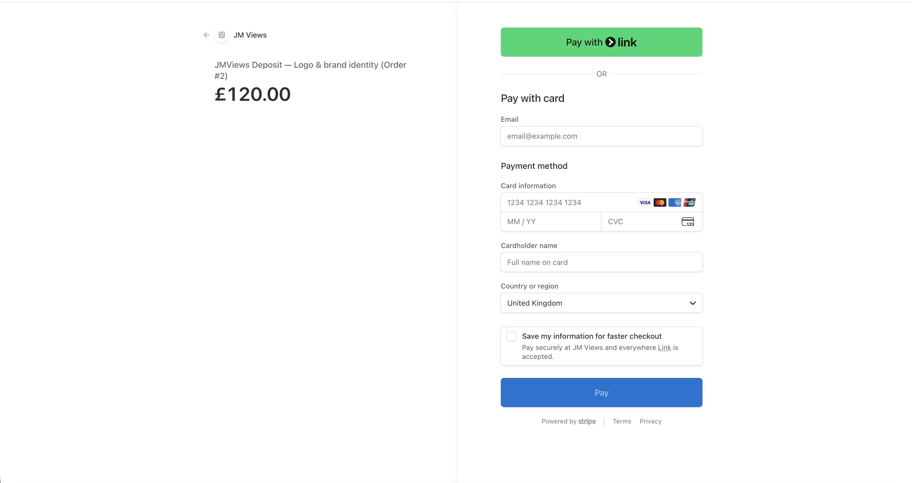

---

#### Admin / Staff Workflow
- Services can be managed via Django admin.
- Orders and deliverables can be managed by staff users.

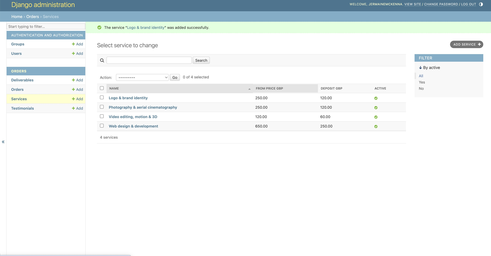

---

### Future Features
- Portfolio uploads in admin (projects gallery).
- Email notifications when:
  - Deposit/final paid
  - New deliverable uploaded
- More detailed order timeline/status updates.
- Optional messaging thread per order.

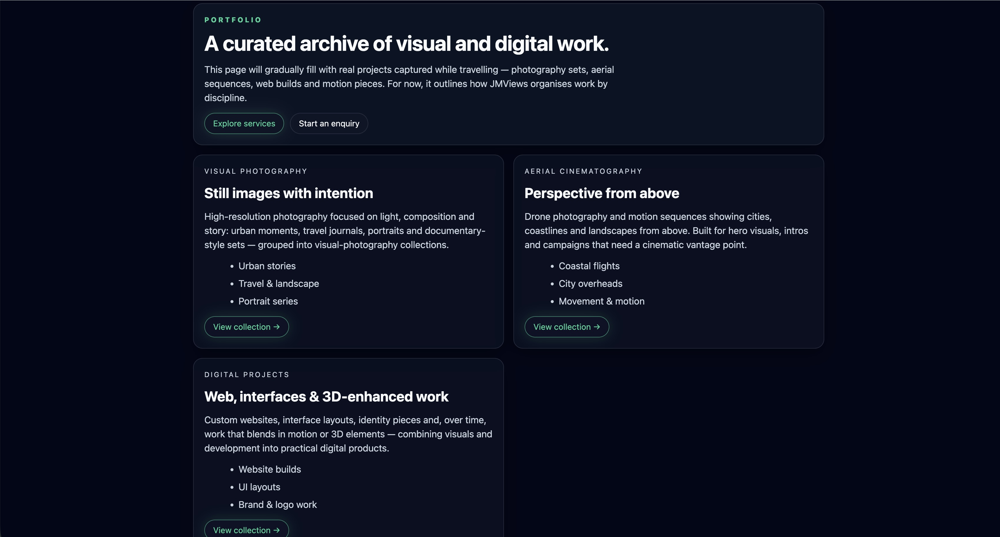

---

## Database & Data Model

The project uses a relational database via Django ORM.

Typical models include:
- **Service** (name, description, from_price)
- **Order** (service, title, brief, status, budget, timestamps, payment state)
- **Deliverable** (order, file upload, note, timestamp)
- Django **User** model for authentication

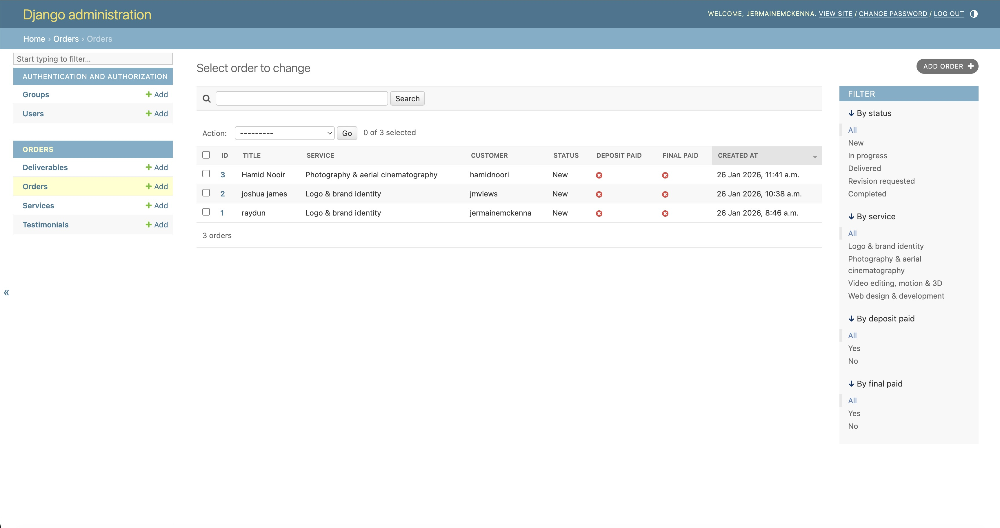
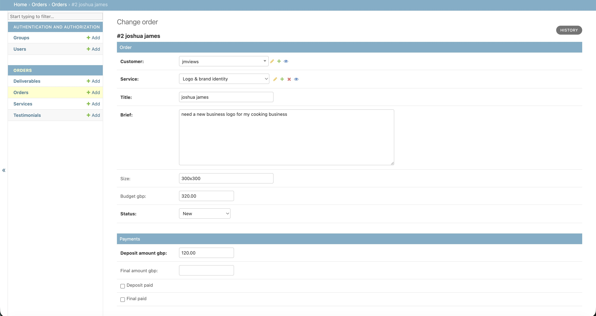

---

## E-commerce / Payments (Stripe)

Stripe is used for secure payments:
- Deposit payment (when enabled on an order)
- Final payment (when set by staff)

Payment status is displayed clearly inside the order detail page.


---

### Database Design
## Entity Relationship Diagram (ERD)

####ERDiagram

    USER ||--o{ ORDER : places
    SERVICE ||--o{ ORDER : is_for
    ORDER ||--o{ DELIVERABLE : has
    USER ||--o{ DELIVERABLE : uploads
    ORDER ||--|| TESTIMONIAL : receives
    USER ||--o{ TESTIMONIAL : writes

    USER {
        int id PK
        string username
        string email
        boolean is_staff
    }

    SERVICE {
        int id PK
        string name
        string description
        decimal from_price_gbp
        decimal deposit_gbp
        boolean active
    }

    ORDER {
        int id PK
        string title
        string brief
        string size
        decimal budget_gbp
        string status

        decimal deposit_amount_gbp
        decimal final_amount_gbp
        boolean deposit_paid
        boolean final_paid

        string stripe_deposit_session_id
        string stripe_final_session_id

        datetime created_at
        datetime updated_at

        int customer_id FK
        int service_id FK
    }

    DELIVERABLE {
        int id PK
        string file
        string note
        datetime created_at

        int order_id FK
        int uploaded_by_id FK
    }

    TESTIMONIAL {
        int id PK
        int rating
        string content
        boolean approved
        datetime created_at

        int order_id FK UNIQUE
        int customer_id FK
    }

    Overview

The JMViews application uses a relational database implemented through Django’s ORM. The system is designed to manage users, services, enquiries (orders), payments, deliverables, and testimonials. The database structure ensures clear relationships between entities while enforcing data integrity through foreign key constraints.

⸻

Service Model

The Service model represents the digital services offered by JMViews (e.g., web design, photography, aerial cinematography).

Key fields:
    •    name (unique)
    •    description
    •    from_price_gbp
    •    deposit_gbp
    •    active

Relationship:
    •    One service can be linked to many orders.
    •    Protected with on_delete=models.PROTECT to prevent deletion of services linked to existing orders.

⸻

Order Model

The Order model is the central entity of the application and represents a customer enquiry.

Key fields:
    •    customer (ForeignKey to User)
    •    service (ForeignKey to Service)
    •    title
    •    brief
    •    size
    •    budget_gbp
    •    status (workflow-controlled using predefined choices)
    •    deposit_amount_gbp
    •    final_amount_gbp
    •    deposit_paid
    •    final_paid
    •    stripe_deposit_session_id
    •    stripe_final_session_id
    •    created_at
    •    updated_at

Relationships:
    •    One user can create many orders.
    •    Each order belongs to one service.
    •    Each order can have many deliverables.
    •    Each order can have one testimonial (OneToOne).

Payment values are snapshotted (deposit_amount_gbp) at creation time to ensure pricing consistency even if the Service deposit changes later.

⸻

Deliverable Model

The Deliverable model stores files uploaded by staff for a specific order.

Key fields:
    •    order (ForeignKey to Order)
    •    file
    •    note
    •    uploaded_by (ForeignKey to User)
    •    created_at

Relationships:
    •    One order can have multiple deliverables.
    •    A deliverable belongs to exactly one order.
    •    Staff users upload deliverables.

on_delete=models.CASCADE ensures that if an order is deleted, its deliverables are also removed.

⸻

Testimonial Model

The Testimonial model stores customer feedback after order completion.

Key fields:
    •    order (OneToOneField)
    •    customer (ForeignKey to User)
    •    rating (1–5 validated)
    •    content
    •    approved
    •    created_at

Relationships:
    •    Each order can have only one testimonial.
    •    A user can write multiple testimonials across different orders.
    •    Testimonials must be linked to a completed order.

⸻

Data Integrity & Security
    •    Foreign key constraints enforce referential integrity.
    •    OneToOneField ensures only one testimonial per order.
    •    PROTECT, CASCADE, and SET_NULL are used appropriately to control
deletion behaviour.
    •    Access control is enforced in the view layer so that:
    •    Users can only view/edit their own orders.
    •    Staff can view and manage all orders.

---

## Testing

### Manual Testing
Manual testing evidence is in: `documentation/testing/`

- Navigation links tested on desktop + mobile
- Account creation and login tested
- New enquiry form tested (validation + submission)
- Order detail display tested
- Stripe deposit payment tested in Stripe test mode
- Deliverable upload tested (staff) and download tested (client)

| Feature | Test Action | Expected Result | Result |
|--------|-------------|----------------|--------|
| Register | Create account | Account created and logged in | Pass |
| Login | Login with valid credentials | User redirected to orders | Pass |
| New enquiry | Submit form | Order created | Pass |
| Pay deposit | Click pay deposit | Stripe checkout loads | Pass |
| Download files | Click download | File opens/downloads | Pass |

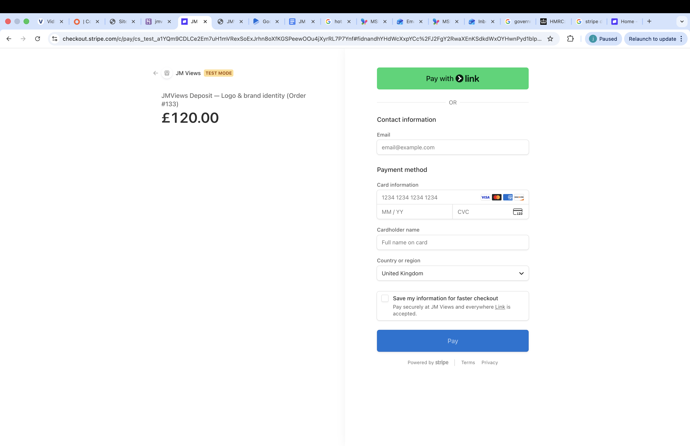
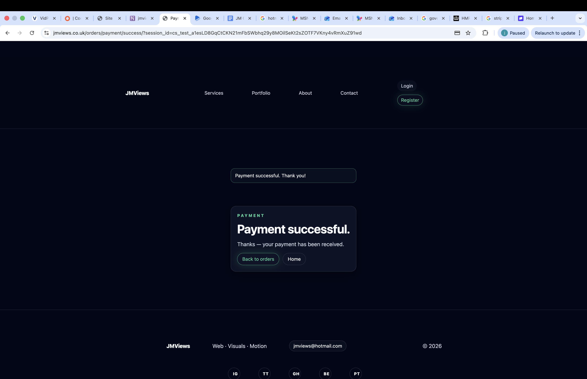
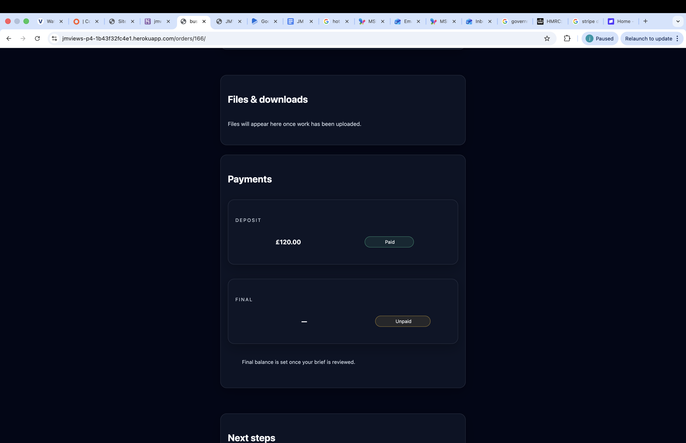

---

### Validator Testing
- **HTML:** W3C validator (no major errors)
- **CSS:** Jigsaw validator (no major errors)
- **Python:** PEP8 / linter checks (where applicable)

---

### Known Bugs
- Minor layout edge cases on very small mobile widths may require additional tuning.
- If any features are unfinished, list them here clearly and explain the impact.
- SEO is having issues on dev tools when checking performance on known devices 


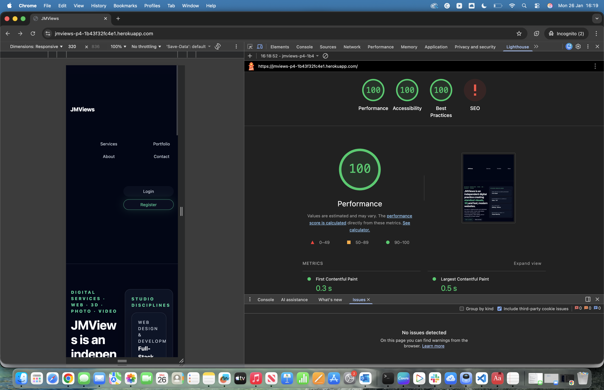
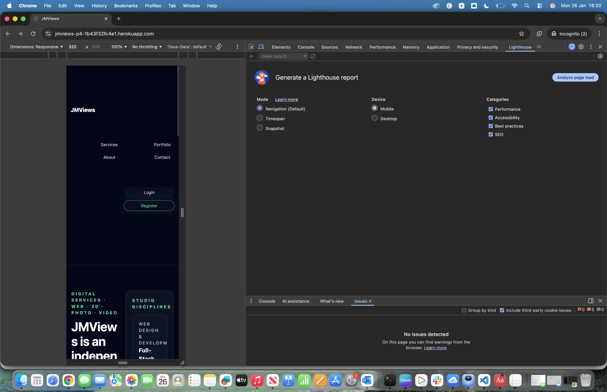


---

## Deployment

### Heroku

**Steps used to deploy:**
1. Create a Heroku app
2. Set config vars in Heroku:
   - `SECRET_KEY`
   - `DEBUG` (False)
   - `ALLOWED_HOSTS`
   - `DATABASE_URL` (Postgres add-on)
   - `STRIPE_SECRET_KEY`
   - `STRIPE_PUBLISHABLE_KEY`
   - `STRIPE_WEBHOOK_SECRET` (if used)
   - `SITE_URL`
3. Add `requirements.txt`
4. Add a `Procfile`:
   - `web: gunicorn config.wsgi`
5. Run migrations:
   - `heroku run python manage.py migrate -a <app-name>`
6. Create a superuser:
   - `heroku run python manage.py createsuperuser -a <app-name>`
7. Collect static (if needed):
   - `heroku run python manage.py collectstatic --noinput -a <app-name>`

Live site: https://jmviews.co.uk/

---

### Local Development

 Clone the repo:
   ```bash
   git clone https://github.com/JermaineMckenna/jmviewsp4.git